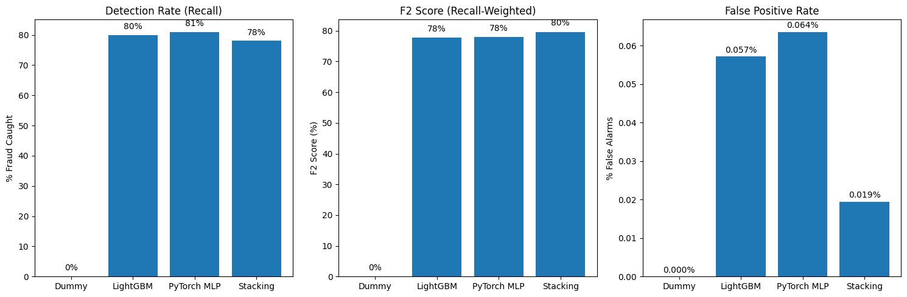

# Fraud-Detection: LightGBM, Pytorch MLP & Stacking Ensemble

## ✅ Problem Statement 
Credit Card Fraud results in billions in annual losses globally.
Traditional rule-based fraud detection systems suffer from the following issues. 

**1. High False Positive Rates**
- Banks decline many legitimate transactions due to overly aggressive rules

- **Customer Impact**:  This leads to customer frustration, churn and revenue loss


**2. Low Fraud Detection**
- Rule-based systems only detect ~60% of fraud patterns
- **Gap**: Criminals adapt faster than static rules can be updated
- **Result**: 40% of fraudulent transactions goes undetected. Given strict regulations in the financial industry, it is often dictated banks should reimburse victims. Hence, fraudulent transactions can lead to severe financial losses for banks. 

Given the multitude of features of transactional data generated in milliseconds, we will need  Machine Learning models that **maximizes fraud detection (recall)**, while **minimizing false alarms** to reduce disruptions to customer transactions. However, due to extreme rarity of fraudulent transactions, data scientists often face problems such as extreme class imbalance while facing fraud datasets. 


## ✅ Project Objectives
Our goal is to achieve maximum performance on the fraud class, as measured by the $F_2$. The $F_2$ metric gives twice the importance to recall over precision, aligning our model's objective with the need to drastically reduce costly false negatives (undetected fraud). Consideration of precision remains important, in order for our model to not raise many false alarms. 

## ✅ My Solution 
Most fraud detection projects use single models. However, since I have just learnt about the utilization of neural networks in my Intro to AI module in SMU (Singapore Management University), I decided to apply it in this project. Given the large amount of data in the dataset, the combination of traditional ML solutions and neural networks may capture hidden fraud patterns. This requires me to conduct extensive experiment tracking & hyperparameter tuning. The below is the final solution blueprint for my project.

1. Tree-based models (**LightGBM**) excel at learning feature interactions but struggle with high-dimensional spaces **(Incoporated Hyperparameter Sweep)**
<br>
2. Deep learning (**PyTorch Multi Layer Perceptron Neural Network**) captures non-linear patterns but may overfit on small datasets (Tuned with **Optuna**)
<br>
3. Ensemble meta-learner (**StackingClassifier**) combines strengths of base models', allowing more robust fraud detection 

```python 
┌─────────────────────────────────────────────────────────────────┐
│                     INPUT: Transaction Features                 │
│         (Time, V1-V28 PCA components, Amount) → 30 features     │
└────────────────────────────┬────────────────────────────────────┘
                             │
            ┌────────────────┴────────────────┐
            │                                  │
┌───────────▼──────────┐          ┌──────────▼───────────┐
│  BASE LEARNER 1:     │          │  BASE LEARNER 2:     │
│  LightGBM Pipeline   │          │  PyTorch MLP         │
│(HyperparameterSwept) │          │  (Optuna Tuned)      │
└───────────┬──────────┘          └──────────┬───────────┘
            │                                |
            └────────────────┬───────────────┘
                             │
                    ┌────────▼────────┐
                    │ META-LEARNER:   │
                    │ Logistic Reg    │
                    └────────┬────────┘
                             │
                    ┌────────▼────────┐
                    │ FINAL OUTPUT:   │
                    │ Fraud / Legit   │
                    └─────────────────┘

```

## ✅ Results 
Results are based on *fraud class*

| Model | Precision | Recall | F1 | F2 | PR-AUC | Business Outcome |
| :---: | :---: | :---: | :---: | :---: | :---: | :---: |
| **Baseline Dummy Classifier** <br>(Always predicts "most frequent") | 0% | 0% | 0% | 0% | 50% |  Catches no fraud |
| **LightGBM <br>x <br>SMOTE Oversampling** | 70% | 80% | 75% | 77% | 81% |  Good recall, too many false alarms |
| **PyTorch <br>Multi Layer Perceptron** | 68% | 81% | 74% | 78% | 80% | Highest recall, but more false alarms |
| **Stacking Classifier** | **87%** | **78%** | **82%** | **80%** | **83%** | **✅ Acceptable High Recall, Extremely High Precision (Maximized $F2$)** |


**Conclusion**: 
- **Stacking Classifier improves precision by +17% compared to individual models** while maintaining decently high recall — **critical for reducing customer friction**. 
- Debates on whether this model should focus on recall / precision more is dependent on company use case, whether their existing priority is maximizing recall / precision 
- A possible solution for this, is checking whether fraudulent transactions is causing higher expected losses compared to customer credit card churn 


## 💹 Business Impact


- **Higher fraud detection = less revenue leakage**
Our models detect around 80% of fraudulent cases, versus 0% for the dummy baseline. In practice, that means we’re catching the majority of bad transactions that will turn into direct financial loss. 
<br>
- **Optimized for recall where missing fraud is very expensive**
We optimized using F2 score, which focuses on recall more heavily than precision. The stacking classifier model achieves the highest F2 score (~80%), meaning it consistently catches more fraud in the scenarios that matter most to the business, even under imbalance and noise. With such a high precision, with acceptable recall, it raises way fewer false alarms, which leads to happier customers and lower churn rates, while maintaining high detection patterns. 
<br>
- **Overall Impact**
The chosen stacking model gives similar fraud capture strength than single models, while significantly reducing false positives. That combination translates into more fraud blocked, lower investigation cost, and a smoother experience for genuine customers — which is ultimately what **maximizes ROI** for this system.

## ✅ Learning Outcomes 
- Attempted modular code organization for reproducibility via OOP 

- Working with `uv` for fast package installing, compared to `pip`

- Data preprocessing and handling imbalanced datasets with **SMOTE oversampling**

- Learning and applying `scikit-learn` metrics, optimized for class imbalance (e.g. F2-score)

- Implementing **Stratified K-Fold Cross Validation** for robust model evaluation (instead of basic & prone to error held-out validation sets)

- Visualizing **model training and diagnostics using loss curves, parallel coordinates plots, and hyperparameter importance** in WandB, to **guide hyperparameter tuning search space decisions**

- Building and training **LightGBM** gradient boosting model

- Learning and using **PyTorch and PyTorch Lightning syntax** for building neural networks, while using MPS (Macbook GPU)

- **Hyperparameter Bayesian optimization** and sweeping via **Optuna and WandB**

- Developing **stacking ensemble meta-classifier** combining different base models

## ✅ Tech Stack 
- **Scikit-Learn**: DummyClassifier & StackingClassifier 
- **LightGBM**: Ensemble Learning Technique 
- **SMOTE Oversampling Technique**
- **Pytorch & Pytorch Lightning**: Neural Network Building 
- **Optuna**: Neural Network Hyperparameter Tuning 
- **WandB**: Experiment Logging & Tracking, Hyperparameter Sweeping


<hr>

## ✅ Project Structure

```
├── LICENSE            <- Open-source license if one is chosen
├── Makefile           <- Makefile with convenience commands like `make data` or `make train`
├── README.md          <- The top-level README for developers using this project.
├── data
│   ├── external       <- Data from third party sources.
│   ├── interim        <- Intermediate data that has been transformed.
│   ├── processed      <- The final, canonical data sets for modeling.
│   └── raw            <- The original, immutable data dump.
│
├── docs               <- A default mkdocs project; see www.mkdocs.org for details
│
├── models             <- Trained and serialized models, model predictions, or model summaries
│
├── notebooks          <- Jupyter notebooks. Naming convention is a number (for ordering),
│                         the creator's initials, and a short `-` delimited description, e.g.
│                         `1.0-jqp-initial-data-exploration`.
│
├── pyproject.toml     <- Project configuration file with package metadata for
│                         fraud_detection_ml and configuration for tools like black
│
├── references         <- Data dictionaries, manuals, and all other explanatory materials.
│
├── reports            <- Generated analysis as HTML, PDF, LaTeX, etc.
│   └── figures        <- Generated graphics and figures to be used in reporting
│
├── requirements.txt   <- The requirements file for reproducing the analysis environment, e.g.
│                         generated with `pip freeze > requirements.txt`
│
├── setup.cfg          <- Configuration file for flake8
│
└── fraud_detection_ml   <- Source code for use in this project.
    │
    ├── __init__.py             <- Makes fraud_detection_ml a Python module
    │
    ├── config.py               <- Store useful variables and configuration
    │
    ├── dataset.py              <- Scripts to download or generate data
    │
    ├── features.py             <- Code to create features for modeling
    │
    ├── modeling
    │   ├── __init__.py
    │   ├── predict.py          <- Code to run model inference with trained models
    │   └── train.py            <- Code to train models
    │
    └── plots.py                <- Code to create visualizations
```

---

## ✅ Steps for Project Setup

1. **Clone Repository**  
   ```python 
   git clone https://github.com/luuuneytunes12/Fraud-Detection-ML.git
    cd Fraud-Detection-ML
<br>

2. **Activate Virtual Environment**
- Using `uv` (fast) 
  ```python 
  uv venv
  source .venv/bin/activate 
  uv sync
- Using `pip`
  ```python 
  pip install -r requirement.txt 
<br>

3. **Download and Prepare Dataset**  
Place the raw credit card transaction CSV under `data/raw/`.  
<br>

4. **Run Notebooks Sequentially**
   Run individual notebooks in `notebooks/`

   

